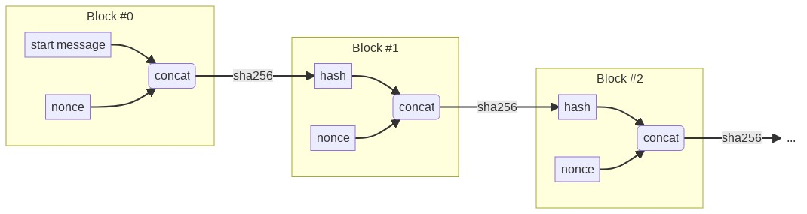

# Hash Chain Benchmark
### A hash chain based benchmark method
HCB is a benchmark method based on a hash chain starting with an initial message. It consists of different successive levels of increasing difficulty. Each level is represented by a block containing a hash of the previous block and a nonce (except the first block).  
It allows you to compare the computing power of different machines via standardized proof of work. Whoever has the longest chain is considered to have done the most work.
### Chain format
An HCB chain is represented as a text containing successive blocks. Each hashed block in sha256 must start with a number of bits equal to 0 corresponding to its block number (the first block has the number 0). The challenge is therefore to find a nonce that generates a hash starting with exactly the right number of zeros. This number must be strictly equal to the block number. This has the effect of doubling the difficulty at each level. It therefore takes on average twice as long to validate a level compared to the previous one. A line is always 64 characters long (except comments and the line containing the original message).  
  
A chain always starts with the line
```HCB 1.0 --------------------------------------------------------```  
This line contains the HCB version used to generate the chain, it must be checked when verifying a chain.  
  
Each block is separed by a line starting with the previous block number followed by a space and padded with dashes (-) up to 64 characters.  
For example:  
```0 --------------------------------------------------------------```  
or  
```42 -------------------------------------------------------------```  
  
__Schema resuming the format of a chain:__  
  
### Block format
A block consists of two lines separated by a single carriage return (\n).  
* The first line of the block is the hexadecimal hash of the previous block. Block 0 is a special case because its first line contains the start message of the chain. It is chosen by the creator of the chain and can have an arbitrary length. The start message must be on one line.
* The second line is a positive or zero integer padded with the right number of 0 to the left to have a length of 64 characters.
  Example:  
  ```0000000000000000000000000000000000000000000000000000003223868834```  

When you hash the two lines on the block (without the final line break) the produced hash must start with exactly the correct number of bits to zero followed by a bit to one.  
  
__Here is an example of a valid block #0:__  
The starting message of the chain will be the URL of this repository: ```https://github.com/TheophileWalter/Hash-Chain-Benchmark```
```
https://github.com/TheophileWalter/Hash-Chain-Benchmark
0000000000000000000000000000000000000000000000000000000000000002
```
If you hash this block, you'll get the following hash: ```d19c8a565da89519becc8e960b1a935b248b8c42c08a38e20149f99b680246bd``` which is in binary representation ```1101000110011100...```, this hash is starting with 0 bits with value 0, that means the block is a valid for position 0.  
  
__Below an example of block #30:__  
Assuming that the hash of the block #29 is ```00000004508ba6d015d922d10adb156875f3baeb033fc8ec750d7e56033ffdec``` and that the chain is valid up to block #29, the block below is a valid #30 block:  
```
00000004508ba6d015d922d10adb156875f3baeb033fc8ec750d7e56033ffdec
0000000000000000000000000000000000000000000000000000003223868834
```
The sha 256 of this block is ```00000002d24fb8e641a981ab85fa5ead09274d092f097c8a12ef650597ef17dc```, in binary it starts with ```0000000000000000000000000000001011010010...```, this hash is starting with 30 bits with value 0 so the block is valid for position 30.  
### Comment lines
In certain cases, it can be useful that certain lines are not taken into account in the chain. These lines are called "comments". They can contain metadata or any annotations about the chain. They will simply be ignored when checking the chain. A comment line starts with a number sign (#) and can have an arbitrary length.  
  
Below a comment example:  
```# This is my comment```  
  
__Possible use for comments__  
The [C-HCB program](c-hcb) (C implementation of HCB) is using comments to store the last tested nonce at the exit of the program. This allow to restart at the same position when the user will resume the computation of its chain.  
It is formatted like below:  
```#nonce:123456```  
When C-HCB will resume the computation, it will restart with the last nonce present in the file.  
This is not an official specification but just an example of comments usage.  
__Important:__ Any HCB implementation must be able to check or continue a chain even if all the comments were removed. Comments must not be essential in the process, just useful.  
### Example
Below is a valid example of a chain starting with the URL of this repository:  
```
HCB 1.0 --------------------------------------------------------
https://github.com/TheophileWalter/Hash-Chain-Benchmark
0000000000000000000000000000000000000000000000000000000000000002
0 --------------------------------------------------------------
d19c8a565da89519becc8e960b1a935b248b8c42c08a38e20149f99b680246bd
0000000000000000000000000000000000000000000000000000000000000017
1 --------------------------------------------------------------
48628a67f5e653563f54cec9bde651ec4a2ca21ed4e97969e3d0d76933433438
0000000000000000000000000000000000000000000000000000000000000000
2 --------------------------------------------------------------
34d3fb0f103c5d5f008b48d7b5abddb2fc00efdf406257edf59a553163b1a82d
0000000000000000000000000000000000000000000000000000000000000019
3 --------------------------------------------------------------
17dae32b805229b170090577c67e5750e6773366d75ee76c2a34c15df647ac3f
0000000000000000000000000000000000000000000000000000000000000063
4 --------------------------------------------------------------
09447a0b6baead4d426ee1d5631a28ce6b745e5507d73fad83ce937c456e95d4
0000000000000000000000000000000000000000000000000000000000000005
5 --------------------------------------------------------------
0744367af0283ec59254f983bcd727c26c3f93d056f1e49d64ab496215705af9
0000000000000000000000000000000000000000000000000000000000000121
6 --------------------------------------------------------------
036e81036d3ea1e2c95ee19e6d35ef10b6b39a389901ecab530ef8eb2e0b8394
0000000000000000000000000000000000000000000000000000000000000681
7 --------------------------------------------------------------
01cd0d5593384352988a4deeb1f48a8dcd8dc15095f3e75fa7bd79f62df03cab
0000000000000000000000000000000000000000000000000000000000000336
8 --------------------------------------------------------------
009a3ea0d722059038cd7c2b3ec86da83f96bd528f103b20c79a3f3a7bf7bd24
0000000000000000000000000000000000000000000000000000000000003985
9 --------------------------------------------------------------
0040a5dfb35741a0d226be04de7032ad3f24c263875c8acd075184500aa311b6
0000000000000000000000000000000000000000000000000000000000002318
10 -------------------------------------------------------------
00204565772ddd0338c29558abd92c907f85dbb05dbd80091c8a7fb199e1ecd6
0000000000000000000000000000000000000000000000000000000000001126
11 -------------------------------------------------------------
0018b930021e3a998564411dc702a17b236a350ea23f021ec102831297fa01e0
0000000000000000000000000000000000000000000000000000000000002157
12 -------------------------------------------------------------
000dca9a288df62cc3afd42dfe4bd4926c2cb98ca1977b118af053b8e5cd8b71
0000000000000000000000000000000000000000000000000000000000000959
13 -------------------------------------------------------------
0005a6e6e3cb2d8bcfe54de6cc1c4fbc62c2b5dc86dcb500786a06ba29d6b840
0000000000000000000000000000000000000000000000000000000000003232
14 -------------------------------------------------------------
0003ac3d19f5f958d065e189c216524c7397eee6ed9f7f8fb7eb39da6f260632
0000000000000000000000000000000000000000000000000000000000042166
15 -------------------------------------------------------------
00012751521d611d6604a304cf78a71a6fa968a90aa41ebe8ce63f821c644b4f
0000000000000000000000000000000000000000000000000000000000100028
16 -------------------------------------------------------------
0000b0b12ca295de3939087199cb839afb60e344cd13f6854e2eb1c1329f7029
0000000000000000000000000000000000000000000000000000000000135723
17 -------------------------------------------------------------
000065a131bbd500b054ab791211334e550e764ffcd420f278a49be6a4c29607
0000000000000000000000000000000000000000000000000000000001029077
18 -------------------------------------------------------------
0000254368b7082977bb1da8a0977bd2a5b3964753175c79bba3da9f1cb7289c
0000000000000000000000000000000000000000000000000000000000267543
19 -------------------------------------------------------------
00001d79433760aff6ad9baad8ac06508b45b90640ec0bb053bbcf9319cde90e
0000000000000000000000000000000000000000000000000000000002632368
20 -------------------------------------------------------------
0000097f64f139d4f6bd6d09535dbf33bd02b20b7d6d55b6b29a670c7be8fbf2
0000000000000000000000000000000000000000000000000000000002632472
21 -------------------------------------------------------------
000004e1e7047b3f4a392b52dd19002281548cf0e4930fc884ee8bbf938a63f7
0000000000000000000000000000000000000000000000000000000001570859
22 -------------------------------------------------------------
00000275a3f5affcbe124de0b9ec2cef37feb5d399a4c57d0844c2fc5e229290
0000000000000000000000000000000000000000000000000000000002718709
23 -------------------------------------------------------------
000001b37e5df6155567c2acd2610ea8c8616dc06600afb0cb9409252759d03b
0000000000000000000000000000000000000000000000000000000015486804
24 -------------------------------------------------------------
000000c9a9546236d693bf0360fb1046ecdb42d17c882475b33a1fd79f43f1a0
0000000000000000000000000000000000000000000000000000000010105807
25 -------------------------------------------------------------
000000595b0d427e82e706c119d5108d7b9066b2e40e1e2dbdacf2cdf7124de4
0000000000000000000000000000000000000000000000000000000189918244
26 -------------------------------------------------------------
00000039f4d1e33b8bbec001d4d54268ef59379c05510e949c3ef909e8b93c06
0000000000000000000000000000000000000000000000000000000090572568
27 -------------------------------------------------------------
0000001eabf64d77299ea64673d217e059a2a80e1db2d2c39e5761e448d99631
0000000000000000000000000000000000000000000000000000000691265284
28 -------------------------------------------------------------
0000000fe29a11e41835297a1cb521551589211023c5fc23a59c85a563123232
0000000000000000000000000000000000000000000000000000000923575620
29 -------------------------------------------------------------
00000004508ba6d015d922d10adb156875f3baeb033fc8ec750d7e56033ffdec
0000000000000000000000000000000000000000000000000000003223868834
30 -------------------------------------------------------------
00000002d24fb8e641a981ab85fa5ead09274d092f097c8a12ef650597ef17dc
```
